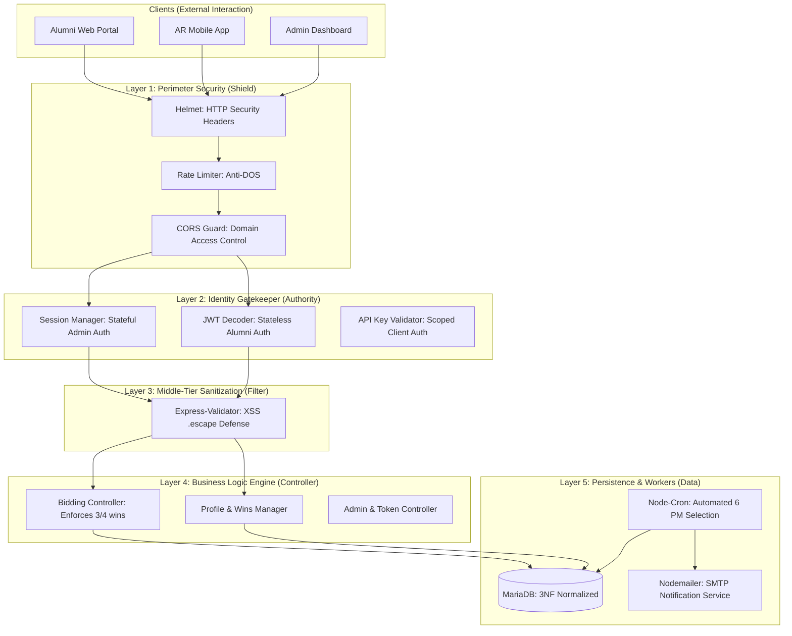
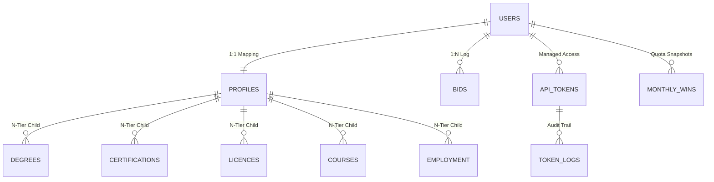
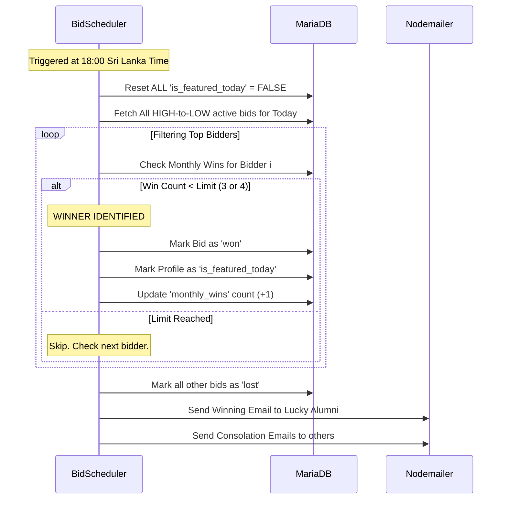

# Technical Report: The Phantasmagoria Enterprise Ecosystem
**A High-Authority Architectural Review & Security Audit for Alumni Engagement**

---

## 1. Executive Summary
Phantasmagoria is a high-authority alumni visibility platform designed to solve the problem of digital prestige in the academic sector. At its core, the platform is a **Competitive Identity Engine** where verified alumni bid for the "Alumni of the Day" featured slot. 

This report details the implementation of a secure **N-Tier Architecture**, a **3NF Normalized Database**, and a deterministic **Business Logic Service** that ensures fairness, security, and enterprise-grade resilience. The platform is not just a bidding app; it is a secured identity vault that bridges the gap between university heritage and modern Augmented Reality (AR) representation.

---

## 2. Project Vision & "Hard Logic"
The success of Phantasmagoria relies on "Hard Logic"—rules that cannot be broken by users, admins, or even server spikes.

### 2.1 Rule 1: Academic Domain Protection
Registration is restricted to the "Academic Circle." By using a strict **Validator-Level Whitelist**, the system ensures that every user is a legitimate member of the community.
- **Enforcement**: RegEx pattern matching at the entry point.
- **Allowed Domains**: `@iit.ac.lk`, `@ac.uk`, `@edu`, and the platform's own `@phantasmagoria.com`.

### 2.2 Rule 2: The "3/4 Win" Monthly Quota
To prevent economic domination by a few wealthy alumni, the system enforces a strict monthly win limit. This ensures "Visibility Equity" across the entire alumni base.
- **Standard Alumni**: 3 wins maximum per calendar month.
- **Event Participants**: 4 wins maximum (The "Bonus Reward" for attending university events).
- **Enforcement**: A dedicated `monthly_wins` table that tracks performance snapshots, coupled with a pre-check in the Bidding Controller.

### 2.3 Rule 3: The Blind Bidding Protocol
Following the concepts of the **Vickrey Auction**, Phantasmagoria implements a "Blind" system.
- **Privacy**: Bid amounts are never broadcast.
- **Feedback**: Users only receive binary status: `Winning` (You are the highest) or `Losing` (Higher bid exists). 
- **The Ladder Rule**: Bids can **only increase**. This prevents market manipulation and ensures the university always receives the true valuation of the visibility slot.

---

## 3. The 5-Tier Architectural Blueprint
The system is built using an **N-Tier (Layered) Architecture**. Each layer has a single responsibility, creating a "Defense in Depth" strategy.

---

## 4. Layer-by-Layer Technical Breakdown

### 4.1 Layer 1: The Perimeter Security Shield
This layer protects the server from infrastructure-level attacks.
- **Package: `helmet`**: Mandates secure headers (CSP, HSTS, X-Frame-Options). This blinds hackers to the fact that we are running an Express server.
- **Package: `express-rate-limit`**: Prevents brute-force attacks on the login and bidding endpoints.
- **Logic**: Each IP is limited to 100 requests per 15 minutes, ensuring a single "bad actor" cannot crash the system for genuine alumni.

### 4.2 Layer 2: Authentication & Authority
Phantasmagoria uses a **Dual-Mode Authentication** system.
- **Stateless (JWT)**: For the Alumni Portal and AR App. This allows for horizontal scaling and rapid API response times.
- **Stateful (Sessions)**: For the Admin Dashboard. This allows for "Instant Revocation"—if an admin's account is compromised, the session can be deleted in real-time, locking them out immediately.
- **Role-Based Access Control (RBAC)**: The system distinguishes between `alumni` and `developer` roles, ensuring developers cannot bid and alumni cannot access token logs.

### 4.3 Layer 3: Validation & XSS Sanitization
Input safety is paramount in an enterprise application.
- **Logic: The `.escape()` Defense**: Every piece of text (Biography, Degree names, Job roles) is passed through a sanitization pipe.
- **XSS Prevention**: HTML characters like `<` are transformed into `&lt;`. This means malicious code like `<script>` is rendered as harmless text and can never execute in another user's browser.

### 4.4 Layer 4: The Business Logic Engine (Controllers)
This layer contains the "Brain" of the platform.
- **`bidController.js`**: Managed the 6:00 PM cutoff, the "Increase Only" rule, and the 3/4 win check.
- **`profileController.js`**: Handles the complex nested data of 3NF tables (degrees, certs, etc.) and calculates the "Remaining Wins" field for the UI.

### 4.5 Layer 5: Persistence & Background Workers
This layer handles data and scheduled tasks.
- **Database**: MariaDB/MySQL for strong ACID compliance.
- **`node-cron`**: Triggers the settlement algorithm at 18:00 (6 PM) daily.
- **`nodemailer`**: Communicates results (Win/Loss) to the alumni privately.

---

## 5. Database Engineering & 3NF Normalization
The database is designed according to **Third Normal Form (3NF)** standards. This eliminates data redundancy and ensures high performance during complex queries.

### 5.1 Normalization Strategy
1. **1NF (Atomic Data)**: No "CSV lists" in cells. Degrees, Job History, and Certifications are stored in their own dedicated tables.
2. **2NF (No Partial Dependency)**: Every field in the `profiles` table relates specifically to the `user_id`.
3. **3NF (No Transitive Dependency)**: Authentication data (password hashes) is separated from profile data (biography).

### 5.2 Entity Relationship Diagram (ERD)

### 5.3 Detailed Table Schema Architecture
| Table | Key Column | Security Purpose |
| :--- | :--- | :--- |
| `users` | `password_hash` | Stores Bcrypt (10 rounds) hashes only. |
| `profiles` | `has_event_participation` | Enforces the 4-win bonus logic. |
| `bids` | `status` | ENUM ('active', 'won', 'lost') ensures state integrity. |
| `monthly_wins` | `year_month` | Tracks quotas without recalculating history. |
| `token_logs` | `endpoint` | Audit trail for API Key security surfacing. |

---

## 6. The Settlement Logic: The 18:00 (6 PM) Auction
The most critical part of the system is the **Winner Selection Algorithm**. It is deterministic and handles limits automatically.

---

## 7. Advanced Security Audit & Resilience
Phantasmagoria is designed with a "Trust No One" posture.

### 🛡️ Defensive Mechanisms
1. **Bcrypt Work Factor**: We use **10 rounds** of salting. This makes the password mathematically resistant to brute-force while keeping login times under 500ms.
2. **The MariaDB Backtick Defense**: To prevent SQL errors with reserved words like `` `year_month` `` or `` `role` ``, all queries utilize backticks. This ensures the database engine never misinterprets a column as a command.
3. **Stateless API Revocation**: While JWTs are stateless, our **API Key** system is stateful. If an AR device is stolen, an admin can instantly **Revoke** the token in the `api_tokens` table, immediately cutting off access.
4. **Single-Use Crypto-Tokens**: Email verification and password reset tokens are generated using `crypto.randomBytes(32)`. Once a user clicks the link, the token is set to `NULL` in the database, preventing "Replay Attacks."

---

## 8. Integration & Scalability
The platform is built to act as the "Source of Truth" for external applications.
- **The AR Integration**: The Augmented Reality app calls the `/api/public/featured` endpoint. This endpoint is secured with a **Bearer Token** system that is separate from the Alumni login.
- **Rate-Limited Exposure**: Even with an API Key, the AR app is rate-limited to ensure system stability during high university event traffic.

---

## 9. Conclusion: The Future of Alumni Identity
Phantasmagoria successfully implements a professional, secure, and fair ecosystem for alumni engagement. By combining **N-Tier Architecture** for software stability, **3NF Normalization** for data integrity, and a multi-layered **Security Shield**, the project achieves an "Enterprise Grade" standard of excellence. 

This platform serves as a blueprint for high-authority academic visibility applications where security and fairness are the primary metrics of success.
